<!-- ⚡ HEADER BANNER ⚡ -->

<!-- Animated text, with colors for both GitHub themes. -->
<picture>
  <source media="(prefers-color-scheme: dark)" srcset="https://readme-typing-svg.demolab.com?font=Fira+Code&amp;weight=600&amp;size=22&amp;pause=1400&amp;color=B6CBA5&amp;center=true&amp;vCenter=true&amp;width=620&amp;height=54&amp;lines=QA+Automation+Engineer%3BPython+%C2%B7+Playwright+%C2%B7+API+Testing%3BIndie+Developer+%C2%B7+SwiftUI+%C2%B7+Unity%3BTest+%C2%B7+Build+%C2%B7+Improve+%C2%B7+Repeat" />
  <source media="(prefers-color-scheme: light)" srcset="https://readme-typing-svg.demolab.com?font=Fira+Code&amp;weight=600&amp;size=22&amp;pause=1400&amp;color=3E654B&amp;center=true&amp;vCenter=true&amp;width=620&amp;height=54&amp;lines=QA+Automation+Engineer%3BPython+%C2%B7+Playwright+%C2%B7+API+Testing%3BIndie+Developer+%C2%B7+SwiftUI+%C2%B7+Unity%3BTest+%C2%B7+Build+%C2%B7+Improve+%C2%B7+Repeat" />
  
</picture>

 

<!-- GitHub follow -->

---

## About me

I'm **Savva Oreshin**, a **QA Automation Engineer** with a strong interest in building products.

- **QA comes first:** Python and Playwright automation, API and web testing, manual and regression testing, and test documentation.
- **Outside of work:** I build personal iOS, web and Unity projects to understand how products are designed, built and tested.
- **QA portfolio:** [QA-Engineer](https://github.com/VanaGoga/QA-Engineer) — regression testing and requirements verification.
---

## 🧰 Tech stack & tools

**QA / Testing**

  
  
  
  
  
  
  

**Development**

  
  
  
  
  
  
  
  

**Backend / Infrastructure**

  
  
  
  

**Editors & DB tools**

  
  
  

---

## 🚀 Projects

> Personal projects · **Private and in development**. Every screenshot below is from an existing build.

<table>
<tr>
<td width="50%" valign="top">

### 🐱⏱ Focusly · Private · In development
A focus timer for people with **ADHD** with a "protect your pet" game mechanic (body doubling).

  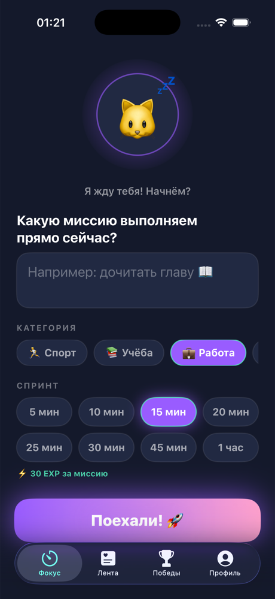
  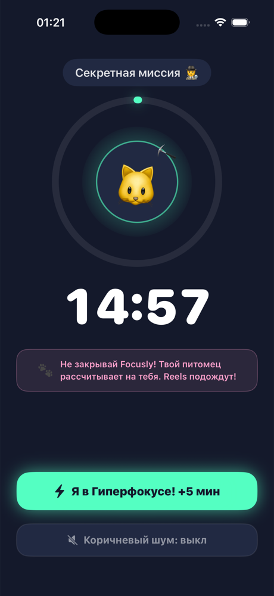
  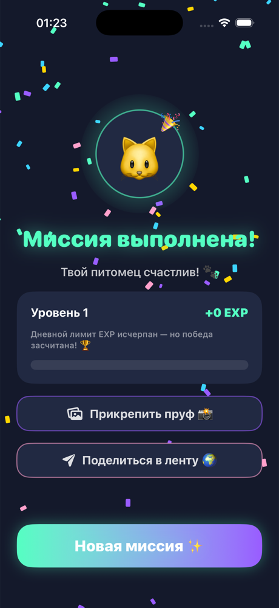

- Virtual pets and EXP progression
- Anti-cheat, procedural "brown noise" via `AVAudioEngine`
- Dark neon theme, haptics, confetti

`Swift` · `SwiftUI` · `iOS 17+`

📸 <b>More screens</b> — support feed, pets & levels

 
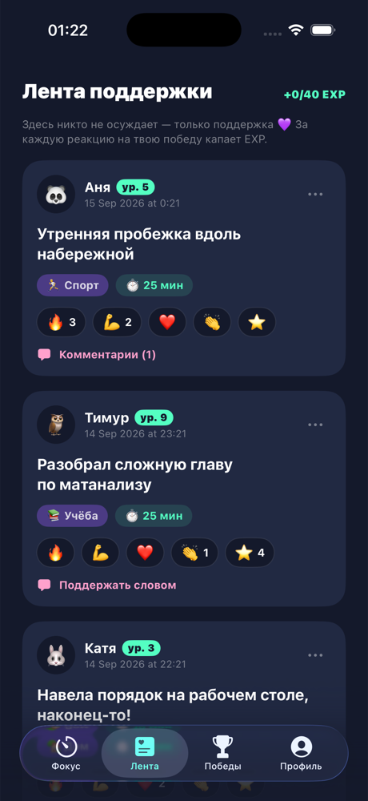
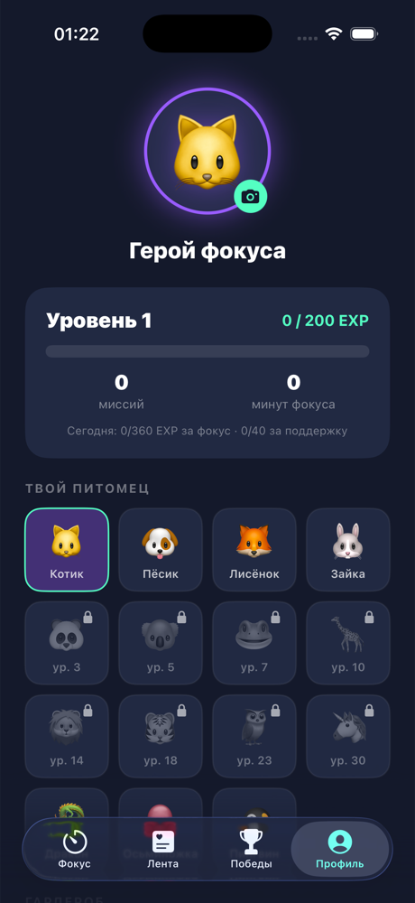

</td>
<td width="50%" valign="top">

### 🎮 TMatching · Private · In development
A service for quickly finding **teammates** for online games — two-way match like Tinder.

  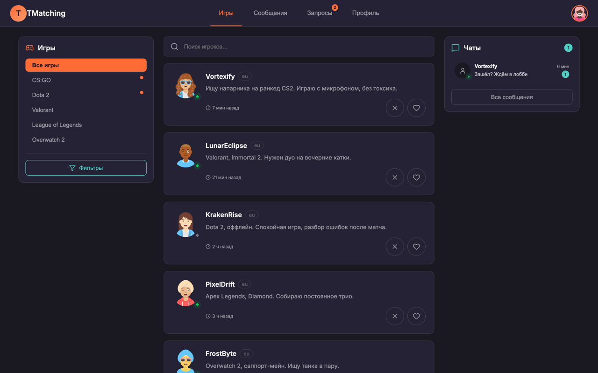

- Steam OpenID authentication
- Real-time via a custom WebSocket hub
- Game catalog synced from the IGDB API

`React` · `TypeScript` · `Go` · `PostgreSQL`

📸 <b>More screens</b> — match, requests, chat, profile

 
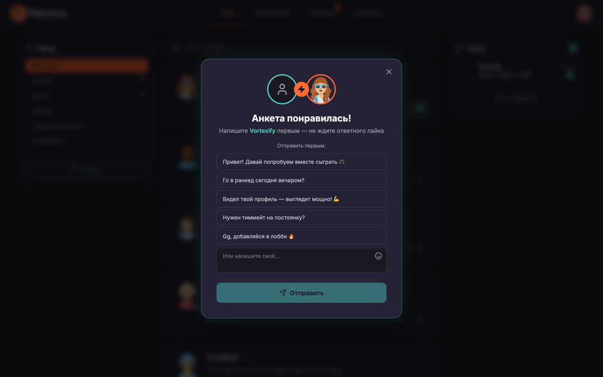
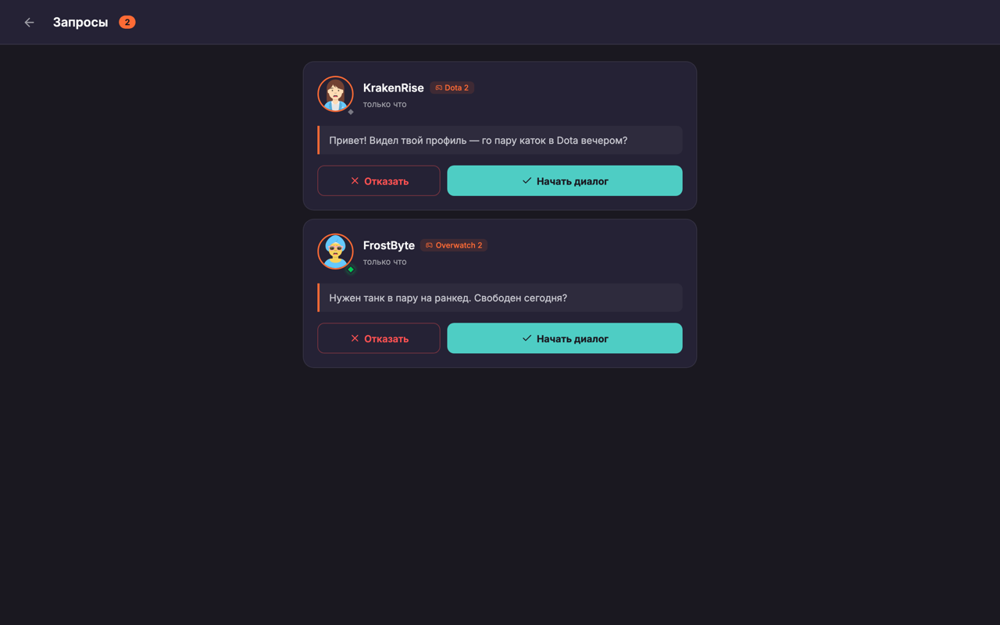
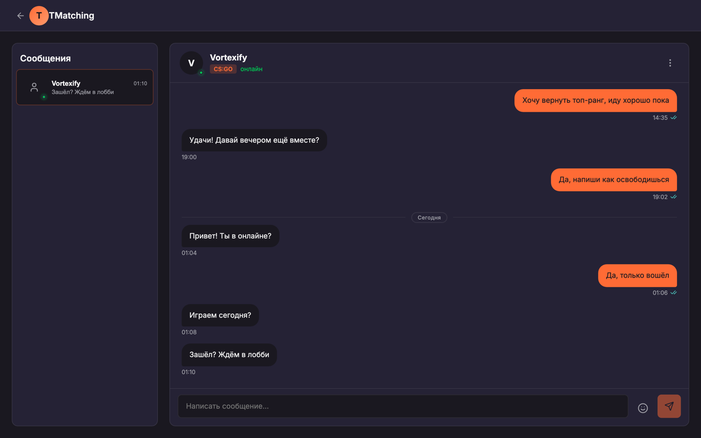
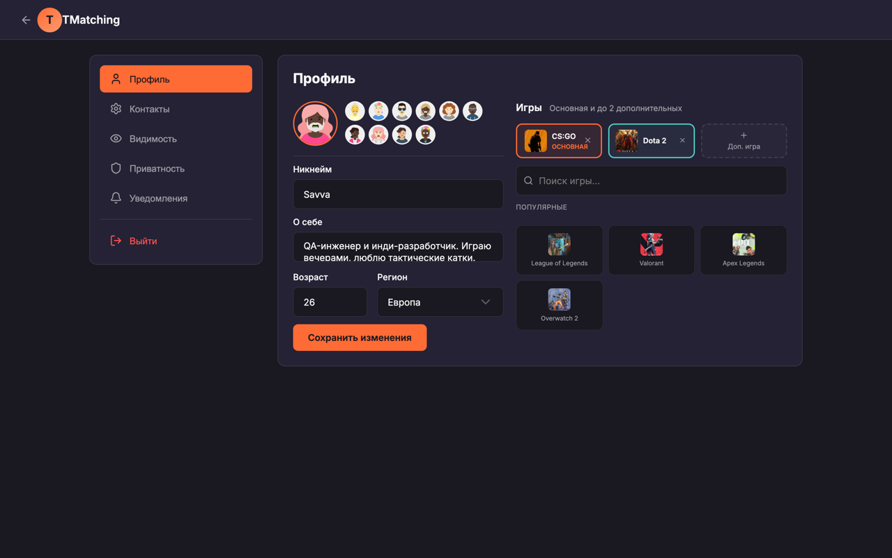

</td>
</tr>
<tr>
<td width="50%" valign="top">

### 🦸 RushHeroes · Private · In development
A mobile **RTS / survival / PvP** project with an arcade-idle loop and a Game Design Document.

  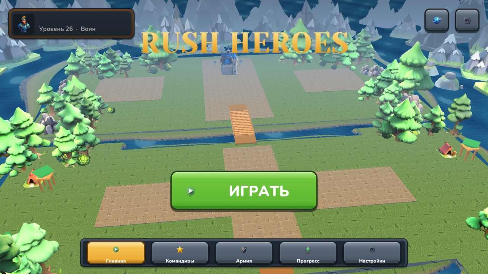

- Core loop: capture zones → farm → towers → assault the base
- Planned 1v1 / 2v2 / 3v3 formats
- Custom shaders

`Unity` · `C#` · `HLSL`

📸 <b>More screens</b> — battle HUD, units, commanders

 
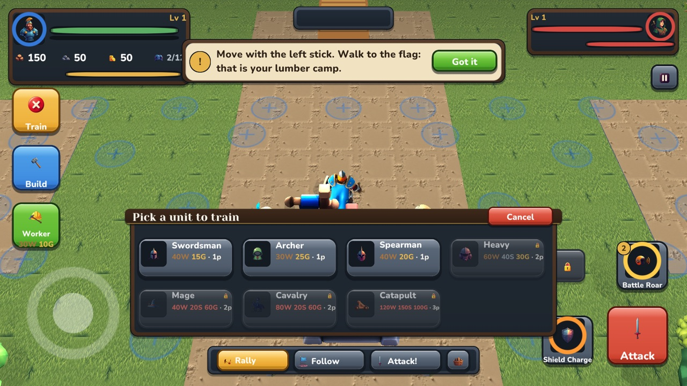
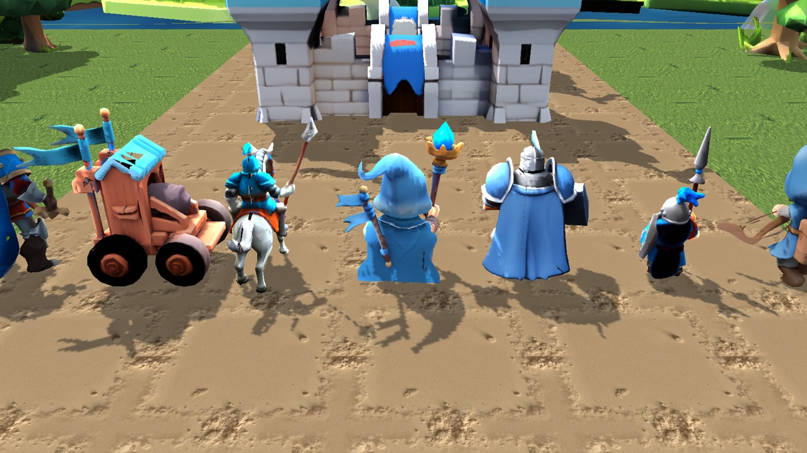
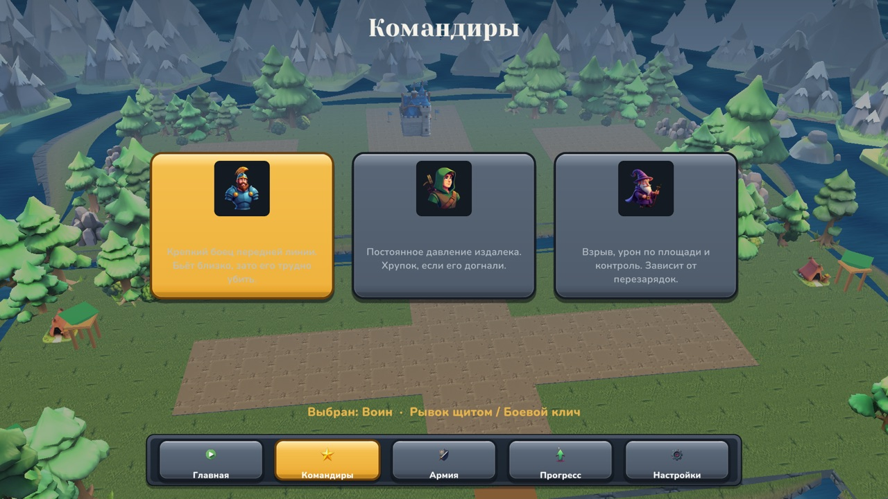

</td>
<td width="50%" valign="top">

### 🧪 [QA-Engineer](https://github.com/VanaGoga/QA-Engineer) · public
QA showcase: regression test cases and requirements verification (Mesto, Yandex Maps).

</td>
</tr>
</table>

---

## 📊 GitHub activity

<!-- 🐍 CONTRIBUTION SNAKE (generated by a GitHub Action) -->

<picture>
  <source media="(prefers-color-scheme: dark)" srcset="https://raw.githubusercontent.com/VanaGoga/VanaGoga/output/github-contribution-grid-snake-dark.svg" />
  <source media="(prefers-color-scheme: light)" srcset="https://raw.githubusercontent.com/VanaGoga/VanaGoga/output/github-contribution-grid-snake.svg" />
  
</picture>

---

### 💬 Let's talk

  

⭐ Thanks for stopping by! Test responsibly 🐞

